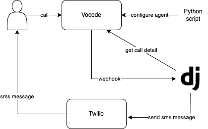

# AI Call Agent Project

1. `ai-call-agent/vocode_config.py`
   1. script to configure Vocode AI agent for the first time. 
   2. run `python vocode_config.py`

2. `ai-call-agent/clinic` and `ai-call-agent/manage.py`
   1. Django web project containig 1 webhook API endpoint to be called by Vocode.
   2. Using `python3`, `venv`, `pip`
   3. `python3 -m venv ai-call-agent_env`
   4. `source ai-call-agent_env/bin/activate`
   5. `pip install -r ai-call-agent/requirements.txt`
   6. `python manage.py runserver`

